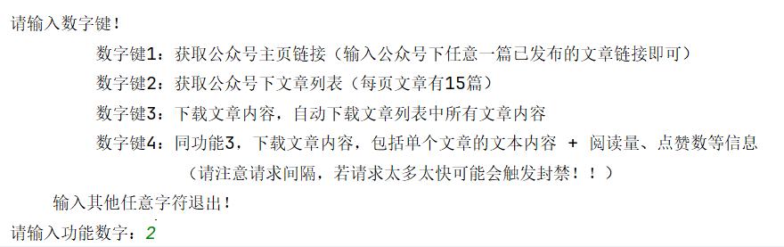

## 微信文章获取（Access_wechat_article）

本项目是基于Python语言的爬虫程序，支持对微信公众号文章内容获取

目前支持 Windows / Linux 开箱即用，**建议使用虚拟环境运行项目**

如果感兴趣，请 **Fork** 项目后自行研究使用

使用过程中如遇到错误，欢迎提交 [issues](https://github.com/yeximm/Access_wechat_article/issues) 来讨论

**注：**请在 [GitHub](https://github.com/) 平台提交 [issues](https://github.com/yeximm/Access_wechat_article/issues)

## 一、主要功能

1. 获取**公众号主页链接**，通过微信内置浏览器可直接打开
2. 获取公众号**已发布**的文章列表（**微信公众号**下的历史文章）
3. 批量下载公众号文章的**网页文本数据**
4. 获取微信公众号文章的**所有信息**，如阅读量、点赞数、转发数、评论、评论点赞等信息。

## 二、项目所需环境及工具

1. 系统环境：Windows 10 ×64
2. 程序运行环境：python 3.12
3. 涉及应用：微信**PC版**，当前项目适配的微信版本为3.9.11.25
4. 使用工具：fiddler

## 三、程序使用

### 3.1下载 / Download

- 下载地址：[https://github.com/yeximm/Access_wechat_article/releases](https://github.com/yeximm/Access_wechat_article/releases)
  - 👆👆👆以上为本项目发布页地址，选取所需版本下载即可。


- 存储库快照：[Github_master](https://github.com/yeximm/Access_wechat_article/archive/refs/heads/master.zip)
  - 存储库快照等同于 [Releases](https://github.com/yeximm/Access_wechat_article/releases) 中的 [Source Code (zip)](https://github.com/yeximm/Access_wechat_article/archive/refs/heads/master.zip) 等，包含 `README` 等内容

### 3.2 Python环境配置

（1）创建虚拟环境

```bash
python -m venv access_wechat
```

`venv`指定存放环境的目录，一般使用 `venv`，这是一个不成文的规定。

（2）**激活**环境

- Windows

  ```bash
  .\access_wechat\Scripts\activate
  ```

- Unix/macOS

  ```bash
  source access_wechat/bin/activate
  ```

（3）退出环境

```bash
deactivate
```

### 3.3 安装包文件

`requirements.txt`中包含所需python包文件名称，用来批量安装python包文件

安装命令：

```bash
pip install -r requirements.txt
```

### 3.4 运行参数

1. 项目主文件为：`main.py`，其功能调用方式详见于此。
   项目中**生成文件的存储路径**为：`./all_data`（该目录由程序**自动创建**）
2. 运行命令：
   
   1. 首先进入**虚拟环境**（详见**激活**虚拟环境）
   
   2. 安装python包文件（如已安装则进行下一步）
   
   3. 在项目目录运行：
   
      - ```bash
        python main.py
        ```
   
   4. 根据控制台提示输入
   
   5. 如需**自定义功能**，参照`main.py`中的函数调用方式自行编写。

## 四、功能截图

### 4.1 功能1


### 4.2 功能2




### 4.3 功能3


### 4.4 功能4


## 五、程序流程图


## 六、鼓励一下

开源不易，若此项目有帮到你，望你能动用你的发财小手**Star**☆一下。

如有遇到代码方面的问题，欢迎一起讨论，你的鼓励是这个项目继续更新的最大动力！

<p align = "center">    

</p>


另外，十分感谢大家对于本项目的关注。

[](https://github.com/yeximm/Access_wechat_article/stargazers)
[](https://github.com/yeximm/Access_wechat_article/network/members)

## LICENSE

本作品采用许可协议 <a rel="license" href="http://creativecommons.org/licenses/by-nc-sa/4.0/">Creative Commons Attribution-NonCommercial-ShareAlike 4.0 International</a> ,简称 **[CC BY-NC-SA 4.0](http://creativecommons.org/licenses/by-nc-sa/4.0/)**。

所有以任何方式查看本仓库内容的人、或直接或间接使用本仓库内容的使用者都应仔细阅读此声明。本仓库管理者保留随时更改或补充此免责声明的权利。一旦使用、复制、修改了本仓库内容，则视为您已接受此免责声明。

项目内容仅供学习研究，请勿用于商业用途。如对本仓库内容的功能有需求，应自行开发相关功能。所有基于本仓库内容的源代码，进行的任何修改，为其他个人或组织的自发行为，与本仓库内容没有任何直接或间接的关系，所造成的一切后果亦与本仓库内容和本仓库管理者无关。

本仓库内容中涉及的第三方硬件、软件等，与本仓库内容没有任何直接或间接的关系。本仓库内容仅对部署和使用过程进行客观描述，不代表支持使用任何第三方硬件、软件。使用任何第三方硬件、软件，所造成的一切后果由使用的个人或组织承担，与本仓库内容无关。

## Star History

[](https://www.star-history.com/#yeximm/Access_wechat_article&Date)

